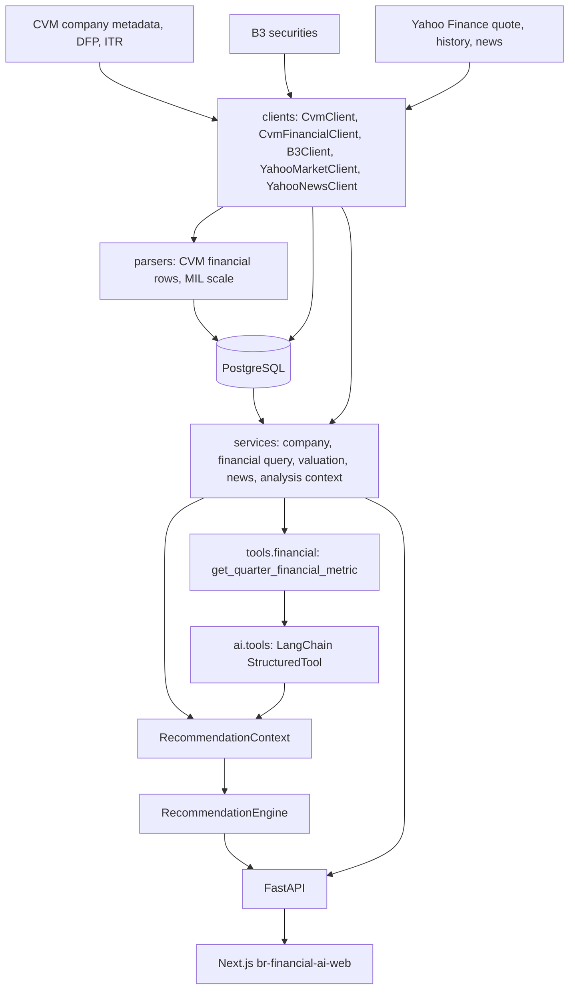
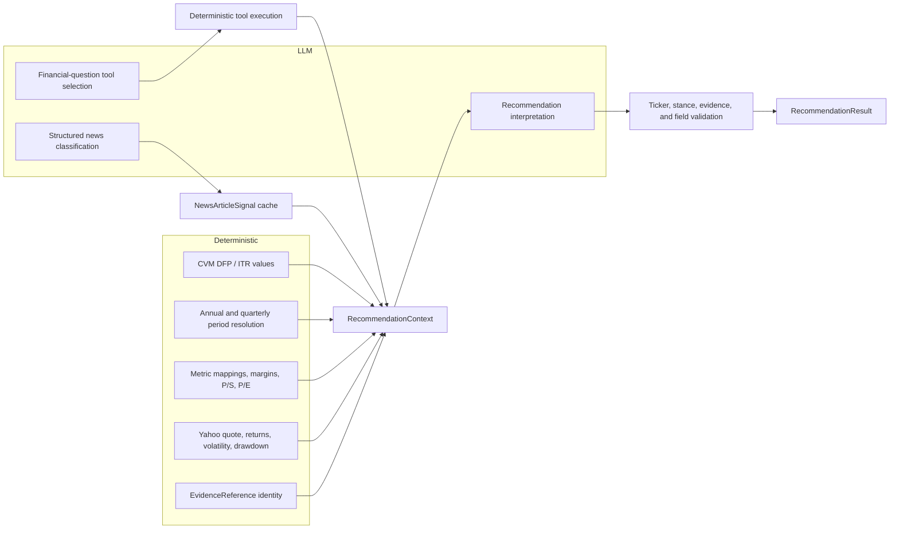
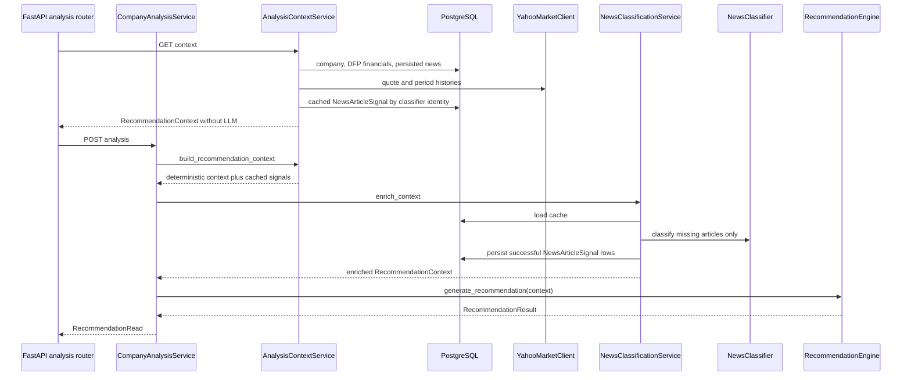
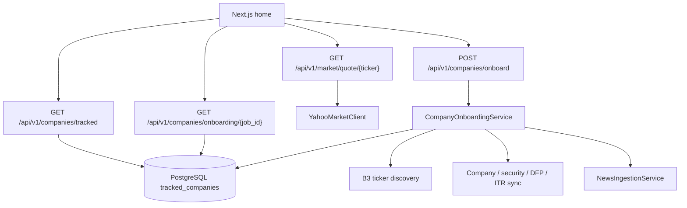
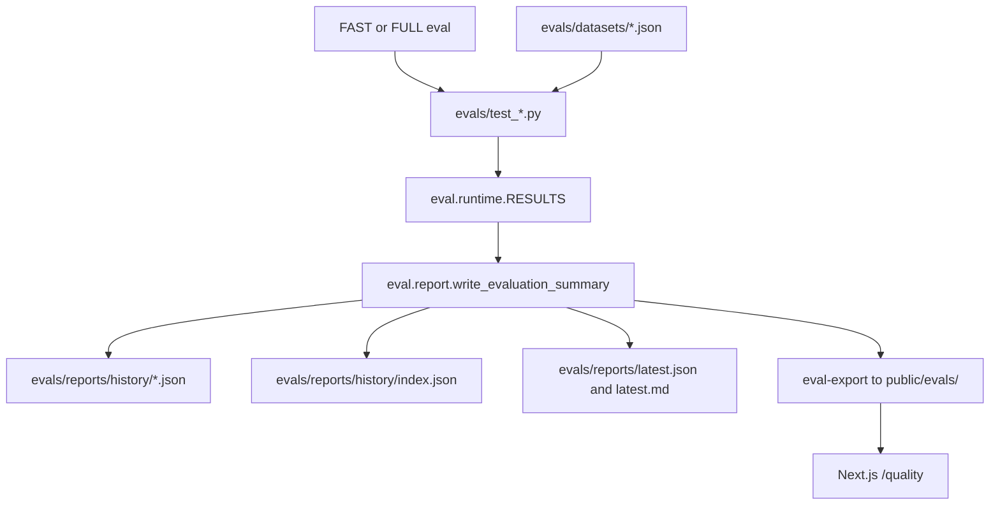

# Architecture

BR Financial AI is an AI Engineering study for Brazilian financial-market
analysis. Data flows from public providers into deterministic services,
then into optional LLM interpretation, then into FastAPI and the Next.js
dashboard.

Issuer identity for a ticker:

```text
Ticker
 ↓
Local Security
 ↓ fallback if needed
B3 ListedCompanies
 ↓
B3 Instruments + CVM fallback
 ↓
Company / Securities
 ↓
DFP / ITR
 ↓
TrackedCompany
```

The LLM never becomes the source of truth for financial numbers.

## Dependency direction

```text
CVM / B3 / Yahoo
      ↓
clients / adapters
      ↓
normalization
      ↓
PostgreSQL / deterministic services
      ↓
framework-independent tools
      ↓
AI adapters
      ↓
RecommendationContext
      ↓
RecommendationEngine
      ↓
FastAPI
      ↓
Next.js
```

## System architecture



CLI ingestion (`br-financial-ai bootstrap`, `sync-financials`,
`sync-news`) writes CVM filings and Yahoo news into PostgreSQL. The API
reads that store and, at request time, calls Yahoo for the live quote and
price history.

## Deterministic versus AI boundary



Deterministic code owns accounting values, ratios, market statistics, and
evidence identifiers. The LLM selects tools, classifies news, and writes
an analytical outlook. `parse_recommendation_output` rejects fabricated
evidence and replaces model-supplied evidence with the context evidence.

## Financial profiles and metric catalogue

Metric semantics depend on `FinancialProfile`, not on ticker prefixes.

```text
Company.setor_ativ (official CVM SETOR_ATIV)
        ↓
FinancialProfile
        ↓
profile-aware catalogue
        ├── NON_FINANCIAL
        └── FINANCIAL_INSTITUTION
```

`SETOR_ATIV` is persisted on `Company` as source metadata.
`Bancos` currently resolves to `FINANCIAL_INSTITUTION`. Other inspected
activities, missing values, and uninspected labels resolve to
`NON_FINANCIAL`. There is no PETROBRAS / ITAU / BRADESCO profile.

`FinancialQueryService` resolves ticker → company → profile → catalogue
→ CVM account. The statement repository stays profile-unaware.

| Metric | Non-financial | Financial institution |
| --- | --- | --- |
| Revenue | yes (DRE 3.01 sales) | no (not industrial sales) |
| Gross profit | yes (DRE 3.03) | no |
| Operating result | yes (DRE 3.05) | no |
| Profit before tax | yes (DRE 3.07) | yes (DRE 3.05 bank PBT) |
| Net income | yes (DRE 3.11) | yes (DRE 3.11, else 3.09 named as consolidated period profit) |
| Financial intermediation revenue | no | yes (DRE 3.01) |
| Financial intermediation result | no | yes (DRE 3.03) |
| Gross / operating / net margin | yes | no (depend on industrial revenue) |
| P/S | when revenue is valid | no |
| P/E | when net income is positive | when net income is positive |

Unsupported metrics are emitted as `unavailable` rows with reason
`METRIC_UNSUPPORTED_FOR_PROFILE`. That is distinct from missing filings.
The dashboard shows `Not applicable` rather than `0` or `Not available`.


## RecommendationContext pipeline

`AnalysisContextService.build_recommendation_context` assembles the
**deterministic** dashboard context: CVM financials, Yahoo market data,
and persisted news. It loads cached `NewsArticleSignal` rows when the
classifier identity matches. It does **not** invoke an LLM.

`GET /api/v1/analysis/context/{ticker}` stops there.

`CompanyAnalysisService.analyze_company` (`POST /api/v1/analysis`) then
calls `NewsClassificationService.enrich_context` to classify only
missing/stale articles, persist those results, and pass the enriched
`RecommendationContext` to `RecommendationEngine`.



`GET /api/v1/analysis/context/{ticker}` never invokes Ollama,
`NewsClassifier`, or `RecommendationEngine`.
`POST /api/v1/analysis` is the explicit AI-triggering operation.
`GET /api/v1/analysis/market-history/{ticker}` returns Yahoo OHLC bars
for the chart and does not invoke the LLM.

Cached news classifications are reusable only for the same classifier
identity: `llm_provider`, `llm_model`, `classifier_version`, and
`prompt_version` (`news-v1`). A prompt or schema change increments that
identity so old rows are treated as a cache miss. Failed classifications
are not stored as fake NEUTRAL results; they remain retryable.

Onboarding still persists news articles only. It does not classify them.

## Tracked companies and ticker onboarding

The home page lists companies the application is tracking. That list is
not the analysis-context endpoint.



Ticker discovery is `CompositeTickerDiscovery`: local Security, B3
ListedCompanies, then the official InstrumentsConsolidated public file
plus CVM `cad_cia_aberta.csv`. Yahoo is not used for issuer identity.

Onboarding persists a `CompanyOnboardingJob`, returns HTTP 202, then
continues in an in-process FastAPI background task that opens a **new**
database session. That executor is for local/single-instance use. It is
**not** durable across process crashes. Job rows remain in PostgreSQL so
a later worker can call `CompanyOnboardingService.run_job`.

Bootstrap (`config/monitored_companies.yaml`) is a seed. Preferred
tickers become `TrackedCompany` rows idempotently. Dynamically added
companies are also stored in PostgreSQL.

The home page never calls `GET /api/v1/analysis/context/{ticker}` and
never invokes Ollama.

## Evaluation loop



`uv run br-financial-ai eval --profile fast|full` is the generator.
The frontend `/quality` page only fetches copied JSON. It does not run
models, Yahoo, or Ollama.

Default `uv run pytest -q` stays inside `tests/` and never enters this
loop.

LangSmith traces individual model calls. `/quality` charts system
quality over time. They are not interchangeable.
